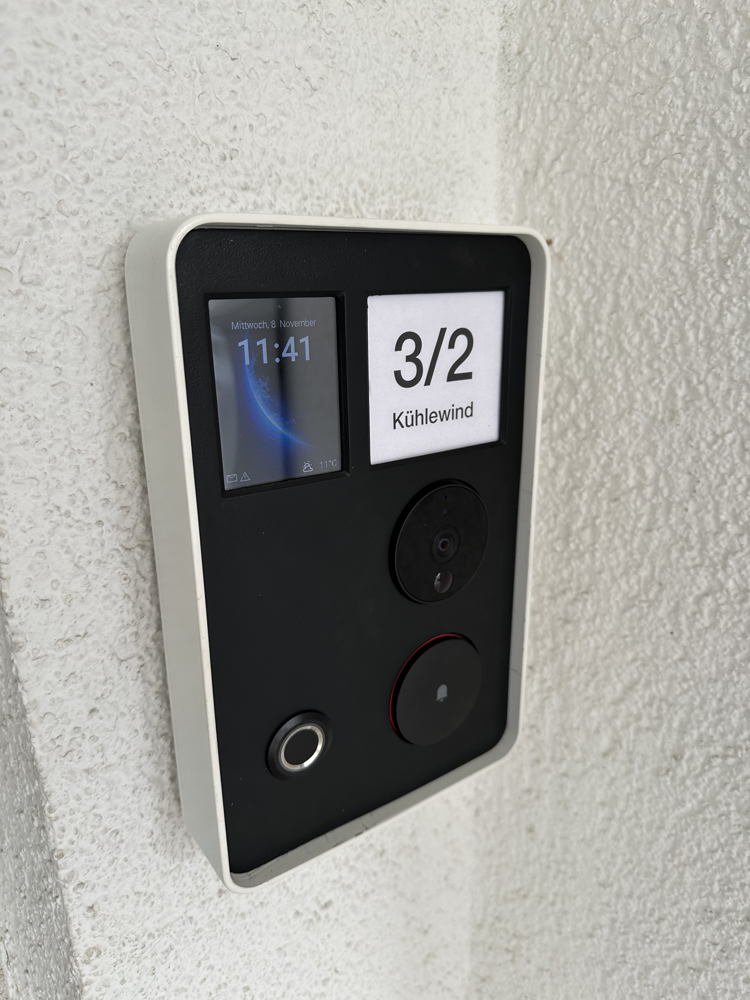
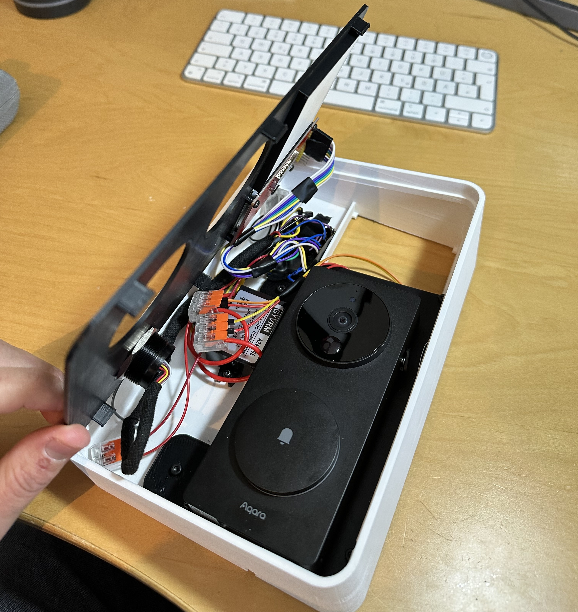

# ESPHome-Doorbell using Aqara G4 inside the case enriched with a Grow R503 fingerprint sensor and 2.8 ILI9341 display

Video doorbell (using Aqara G4) for [Home Assistant](https://www.home-assistant.io) and [ESPHome](https://www.esphome.io). 
It integrates a Grow R503 fingerprint sensor to open a door (in my case a NUKI door lock) via HomeAssistant and additionally I added an ILI9341 display to show some status information like temperature, closed window indicator and most importantly some messages. I can set some messages in a text sensor in HomeAssistant to show them on the display, e.g. to tell the delivery person to just leave the package in the garage. The Aqara is independent of the fingerprint and the display and is only integrated into the housing to make it look nice. The Aqara G4 is simply added via Homekit.

### Features:

- Aqara G4 Videodoorbell as doorbell which I integrated in the case
- Fingerprint Sensor Grow R503 to trigger actions like door opening or you can use it as doorbell
- Display to show some status infos and messages
- Using [ESPHome](https://www.esphome.io) which makes it easy to code and modify for your needs

## Parts needed

| Part                         | Price   | Comment                                         |
|------------------------------|---------|-------------------------------------------------|
| Aqara G4                     | 90$     | Aqara G4 Homekit Cam                            |
| Grow R503                    | 15$     | Get one from AliExpress   					   |
| ILI9341					   | 15$     | 2.8"                   					       |
| ACDC Converter (in my case)  | 5$      | I had some 15V AC wire available so I used an ACDC converter to run the ESP with 5V               |

## How
- Flash your ESP32 via ESPHome and use the yaml from the esphome folder. Adjust to your needs
- Print the parts. 
- Use a few screws to attach the display and the Aqara Mount Plate
- Solder the connections or just use some pin connectors and WAGO connectors
- Assemble

## HomeAssistant
- Create some helpers in home assistant with the following types

| ID                           | Type                             | Comment                                                                                            |
|------------------------------|----------------------------------|----------------------------------------------------------------------------------------------------|
| input_text.doorbell_text                              | text    | Notification text. Use "," to terminate each line ie. "Leave parcels,outside,"                     |
| input_text.doorbell_headline                          | text    | Headline of notification.                                                                          |
| input_text.doorbell_subheadline                       | text    | Sub-Headline of notification.                                                                      |
| input_boolean.doorbell_display_mailbox_notification   | switch  | Doorbell Display Mailbox Notification                                                              |

## Connections
Follow the connection diagram, which shows how to put everything together.

| Glow R5                      | PIN  ESP32   | Comment                                         |
|------------------------------|--------------|-------------------------------------------------|
| TX                           | G13          | Yellow (RX & TX are twisted)                    |
| RX                           | G15          | Green      (RX & TX are twisted)          	    |
| GND   					   | GND          | Obvious                					        |
| WAKEUP                       | G16          | Sensing PIN                                     |
| 3.3V                         | 3.3V         | Red                                             |
| 3.3VT                        | 3.3V         | White                                           |

| ILI9341                      | PIN  ESP32   | Comment                                         |
|------------------------------|--------------|-------------------------------------------------|
| CS                           | G27          | CS                                              |
| D/C                          | G26          | DC                                              |
| RESET                        | G5           | RESET                                           |
| SCK                          | G18          | Clock PIN, CLK                                  |
| SDI (MOSI)                   | G23          | SDI                                             |
| SDOK (MISO)                  | G19          | SDOK (MISO)                                     |
| LED                          | G4           | LED Backlight                                   |
| GND                          | GND          | Ground                                          |
| VCC                          | 3.3V         | Power                                           |\

## 3D Print
See folder print to get all SLT files and the fusion360 file. Feel free to adjust and remix\

# DISCLAIMER
This project is to be considered as a work in progress. 
In my case I have a Siedle doorbell mounted outside and its not my house - so the case has some cut out on the backside that just fits perfectly over the existing Sidle doorbell.
So I just covered the old doorbell and used the power connection from it. As doorbell I now use the Aqara G4 (Homekit) and just added the fingerprint and display for fun to enter my house and show some messages.
Feel free to adjust and remix the 3D cover to your needs. Its designed in Fusion 360 (see folder fusion360)

## Other
Example screenshot of notification

